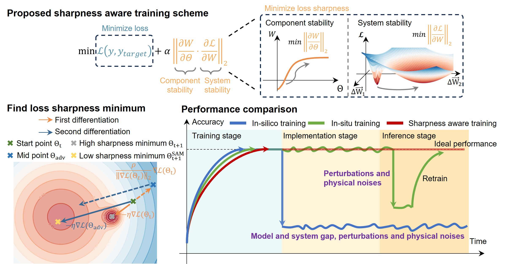

# Sharpness-Aware-Training
The open source code for our proposed Physical Neural Network (PNN) training method, Sharpness-Aware Training (SAT).



Inspired by Sharpness-Aware Minimization (SAM) [Paper](https://openreview.net/forum?id=6Tm1mposlrM) and [Code](https://github.com/google-research/sam), which was originally developed to enhance model generalization under data distribution shifts, we propose SAT to generally facilitate PNN's real-world deployment by searching for robust minima to all types of imperfections without re-training. 
 
---> **The key to this work is that it automatically finds the robust minima without requiring any prior knowledge of the physical system.**

---> **SAT aims not to replace the existing methods but to use the gradient information provided by the existing methods to generally improve the PNN's robustness post-training under noises, perturbations, and system misalignment.**

---> **Key modification 1 with SAM: Weight optimization -> Control parameter optimization. Maximally increase PNN's robustness.**

---> **Key modification 2 with SAM: Finite difference method to approximate gradient. Generally applicable to different PNN.**


Our codes are constructed based on many excellent works and well-established techniques.

Novel PNN training works, 
1. Physical-Aware-Training (PAT), [Paper](https://www.nature.com/articles/s41586-021-04223-6), [Code](https://github.com/mcmahon-lab/Physics-Aware-Training)
2. Dual-Adaptive-Training (DAT), [Paper](https://www.nature.com/articles/s42256-023-00723-4), [Code](https://github.com/THPCILab/DAT_MPNN)
3. Noise-Aware-Training (NAT), [Paper1](https://www.nature.com/articles/s41467-022-33259-z), [Code](https://github.com/georgemourgias/noise_aware_cpnn); [Paper2](https://www.science.org/doi/10.1126/sciadv.abm2956); [Paper3](https://ieeexplore.ieee.org/document/9472868); [Paper4](https://advanced.onlinelibrary.wiley.com/doi/full/10.1002/aisy.202200029)

Well-established techniques,
1. Sharpness-Aware Minimization (SAM),  [Paper](https://openreview.net/forum?id=6Tm1mposlrM), [Code1](https://github.com/google-research/sam), [Code2](https://github.com/davda54/sam)
2. Plot loss landscape, [Code](https://github.com/marcellodebernardi/loss-landscapes/tree/master)
3. Evaluate model's robustness, [Code](https://github.com/google/spectral-density)
4. Mach-Zehnder Interferometer (MZI) mesh simulation tools, [Paper](https://www.nature.com/articles/nphoton.2017.93), [Code](https://github.com/solgaardlab/neurophox)
5. Deep diffraction neural network (D2NN) simulation tools, [Paper](https://www.science.org/doi/10.1126/science.aat8084), [Code](https://github.com/Loli-Eternally/D2NN-with-Pytorch)

# Getting started (Demo)
The required environment libraries are summarized at the beginning of each code. Please download the libraries first and then run the code.

The demo code is 'System1-MRR Weight Bank / 01-Training with different methods.ipynb'

# System requirements
- Python 3.9.19
- PyTorch 2.6.0+cu118 (CUDA 11.8 required)
- NumPy 1.21.5

# Cite this work
If you find our code helpful in your research or work, please cite our paper.

```bibtex
@article{xu2024perfecting,
  title={Perfecting Imperfect Physical Neural Networks with Transferable Robustness using Sharpness-Aware Training},
  author={Xu, Tengji and Luo, Zeyu and Liu, Shaojie and Fan, Li and Xiao, Qiarong and Wang, Benshan and Wang, Dongliang and Huang, Chaoran},
  journal={arXiv preprint arXiv:2411.12352},
  year={2024}
}
